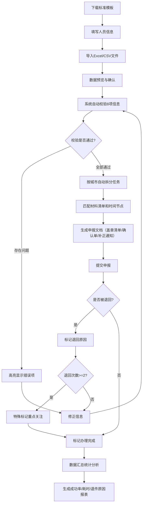

## 1. 产品概述

本系统是面向企业人事专员和集团HR的社保关系转移接续批量申报工具，旨在解决员工跨地区流动时社保转移手续繁琐、容易遗漏、重复返工等问题。系统通过统一核对清单、智能校验、批量拆分任务、自动提醒和数据分析，帮助企业提高社保转移办理效率，减少错误和遗漏。

**核心价值**：
- 统一管理离职、调岗、异地派驻三类人员的社保转移申报
- 逐人智能校验8项关键信息，提前发现问题
- 按城市自动拆分任务，提醒适用材料和时间节点
- 一键生成各类申报文档，减少人工重复劳动
- 数据分析帮助企业优化办理流程，提升成功率

---

## 2. 核心功能

### 2.1 用户角色

| 角色 | 注册方式 | 核心权限 |
|------|----------|----------|
| 人事专员 | 企业账号登录 | 导入名单、校验信息、生成文档、提交申报 |
| 集团HR | 管理员账号登录 | 查看全公司数据、统计分析、批量审核 |

### 2.2 功能模块

1. **首页仪表板**：数据概览、待办提醒、快捷操作
2. **人员名单导入**：支持Excel/CSV导入，数据解析与预览
3. **信息校验中心**：逐人8项信息校验，问题高亮标注
4. **申报任务管理**：按城市拆分任务，材料与时间提醒
5. **文档生成中心**：盖章清单、确认单、补正通知生成
6. **退回标记管理**：多次退回人员标记，原因记录
7. **数据统计分析**：成功率、耗时、退件原因汇总

### 2.3 页面详情

| 页面名称 | 模块名称 | 功能描述 |
|----------|----------|----------|
| 首页仪表板 | 数据概览卡片 | 展示待处理人数、本月申报数、成功率、平均耗时等关键指标 |
| 首页仪表板 | 待办提醒列表 | 列出即将到期的申报任务和需要补正的人员 |
| 首页仪表板 | 快捷操作区 | 快速跳转到导入、校验、生成文档等核心功能 |
| 人员导入页面 | 模板下载 | 提供标准Excel模板下载 |
| 人员导入页面 | 文件上传 | 支持拖拽上传Excel/CSV文件，实时解析预览 |
| 人员导入页面 | 数据预览 | 显示导入数据，支持编辑和删除错误行 |
| 信息校验页面 | 人员列表 | 展示所有导入人员，支持按状态、城市、类型筛选 |
| 信息校验页面 | 校验详情面板 | 显示8项校验项的详细结果，错误项高亮 |
| 信息校验页面 | 批量操作 | 支持批量标记、批量导出校验结果 |
| 任务管理页面 | 城市分组 | 按转入地城市分组展示申报任务 |
| 任务管理页面 | 时间线提醒 | 显示每个任务的关键时间节点和材料清单 |
| 任务管理页面 | 任务状态流转 | 支持标记待提交、已提交、已完成、已退回等状态 |
| 文档生成页面 | 文档类型选择 | 选择生成盖章清单、确认单或补正通知 |
| 文档生成页面 | 人员筛选 | 按条件选择需要生成文档的人员 |
| 文档生成页面 | 预览下载 | 在线预览生成的文档，支持PDF/Word格式下载 |
| 退回管理页面 | 退回人员列表 | 展示所有被退回的人员，按退回次数排序 |
| 退回管理页面 | 原因标记 | 记录每次退回的具体原因，支持常见原因快捷选择 |
| 退回管理页面 | 重新申报 | 支持修正后重新提交申报 |
| 统计分析页面 | 地区成功率 | 按地区展示办理成功率排行榜和趋势图 |
| 统计分析页面 | 耗时分析 | 展示各地区平均办理耗时和分布情况 |
| 统计分析页面 | 退件原因统计 | 高频退件原因词云和分类统计图表 |

---

## 3. 核心流程

### 主要业务流程

人事专员首先下载标准模板，按照模板格式填写离职、调岗或异地派驻人员的社保转移信息。然后将Excel文件导入系统，系统自动解析并展示数据预览。确认无误后提交数据，系统自动对每位员工进行8项关键信息校验（姓名、证件号、当前参保地、转入地、停保时间、是否已享受待遇、是否存在重复缴费、是否缺少单位证明），并将校验结果高亮显示。

校验通过的人员，系统自动按转入地城市进行分组，生成各城市的申报任务清单，并为每位员工匹配适用的材料清单和办理时间节点。人事专员可以选择需要申报的人员，一键生成企业盖章清单、员工签署确认单和补正通知等文档。

提交申报后，如果被社保机构退回，系统支持标记退回原因，对于多次退回的人员进行特殊标记。所有申报数据会被汇总分析，生成各地区办理成功率、平均耗时和高频退件原因等统计报表，帮助集团HR优化办理流程。

---

## 4. 用户界面设计

### 4.1 设计风格

**设计定位**：专业、高效、可信赖的企业级管理系统

- **主色调**：深蓝色 (#1E3A5F) - 代表专业、稳重、可信赖
- **辅助色**：
  - 成功绿 (#22C55E) - 校验通过、办理完成
  - 警告橙 (#F59E0B) - 待处理、即将到期
  - 错误红 (#EF4444) - 校验不通过、已退回
  - 信息蓝 (#3B82F6) - 普通信息、进行中
- **背景色**：浅灰白 (#F8FAFC) 为主体背景，白色 (#FFFFFF) 为卡片背景
- **按钮风格**：直角按钮，2px圆角，悬停时有轻微上浮和阴影效果
- **字体**：
  - 标题字体：Noto Serif SC - 稳重专业
  - 正文字体：Noto Sans SC - 清晰易读
  - 数字字体：JetBrains Mono - 数据展示清晰
- **布局风格**：卡片式布局，左侧导航栏 + 顶部操作栏 + 主内容区
- **图标风格**：线性图标，粗细统一为1.5px，风格简洁专业

### 4.2 页面设计概述

| 页面名称 | 模块名称 | UI元素 |
|----------|----------|--------|
| 首页仪表板 | 数据概览卡片 | 4张统计卡片，渐变背景色，数据动画加载，悬浮效果 |
| 首页仪表板 | 待办提醒列表 | 时间线样式展示，紧急程度用颜色区分，支持一键跳转 |
| 人员导入页面 | 文件上传区 | 拖拽上传区域，虚线边框，拖入时有高亮效果 |
| 人员导入页面 | 数据预览表格 | 斑马纹表格，支持列宽调整，错误行红色背景标记 |
| 信息校验页面 | 校验进度条 | 顶部总校验进度，每人校验结果用徽章标记 |
| 信息校验页面 | 校验详情面板 | 右侧滑出面板，8项校验用对勾/叉号图标清晰展示 |
| 任务管理页面 | 城市分组卡片 | 每个城市一张卡片，包含人员数量、截止时间、进度环形图 |
| 文档生成页面 | 文档预览 | 嵌入Word/PDF预览，支持翻页和缩放 |
| 统计分析页面 | 图表区域 | ECharts柱状图、折线图、饼图、词云图，支持导出图片 |

### 4.3 响应性

- **桌面优先**：针对1920x1080及以上分辨率优化
- **平板适配**：1024px及以上，导航栏可收起，卡片自适应排列
- **移动适配**：768px以下，底部导航栏，单列布局，表格支持横向滚动
- **交互优化**：按钮最小尺寸44x44px，支持触摸滑动操作

---

## 4.4 交互与动画

- **页面加载**：骨架屏加载，数据渐入显示
- **表格操作**：行悬停高亮，点击选中动画
- **模态框**：缩放渐入动画，背景模糊
- **校验过程**：进度条动态增长，校验结果逐条显示
- **图表动画**：数据柱状图从底部升起，折线图路径绘制动画
- **通知提醒**：右上角滑入通知，3秒后自动消失
