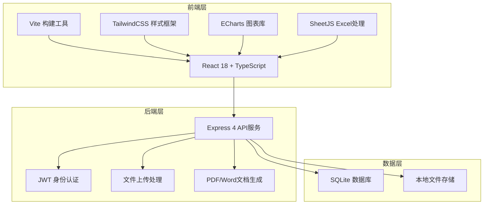
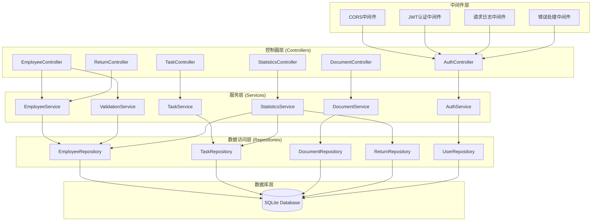
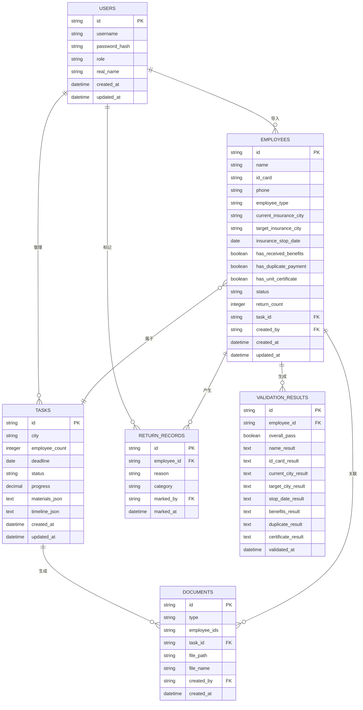

## 1. 架构设计

本系统采用前后端分离的单页应用架构，前端使用React实现用户界面和交互逻辑，后端使用Express提供API服务和数据持久化。数据存储采用SQLite轻量级数据库，适合企业内部使用。



---

## 2. 技术描述

### 2.1 前端技术栈
- **框架**: React@18.2.0 + TypeScript@5.3.0
- **构建工具**: Vite@5.0.0
- **样式方案**: TailwindCSS@3.4.0
- **路由管理**: React Router@6.20.0
- **状态管理**: Zustand@4.4.0
- **UI组件**: 自定义组件 + Lucide React图标库
- **图表库**: ECharts@5.4.0 + echarts-for-react
- **Excel处理**: SheetJS (xlsx)@0.18.5
- **文件下载**: file-saver@2.0.5
- **HTTP客户端**: Axios@1.6.0

### 2.2 后端技术栈
- **运行时**: Node.js@18+
- **Web框架**: Express@4.18.2
- **认证**: jsonwebtoken@9.0.2
- **数据库**: SQLite3 + better-sqlite3
- **ORM**: kysely@0.27.0
- **文件上传**: multer@1.4.4
- **文档生成**: pdfkit@0.14.0, docxtemplater@3.40.0
- **CORS**: cors@2.8.5

### 2.3 初始化方式
- 前端: `npm create vite@latest frontend -- --template react-ts`
- 后端: `npm init -y` 手动配置

---

## 3. 路由定义

### 前端路由 (React Router)

| 路由路径 | 页面名称 | 说明 |
|----------|----------|------|
| / | 首页仪表板 | 数据概览、待办提醒、快捷操作 |
| /import | 人员导入 | 模板下载、文件上传、数据预览 |
| /validation | 信息校验 | 人员列表、8项校验详情、批量操作 |
| /tasks | 任务管理 | 城市分组、时间线提醒、状态流转 |
| /documents | 文档生成 | 文档类型选择、人员筛选、预览下载 |
| /returns | 退回管理 | 退回人员列表、原因标记、重新申报 |
| /statistics | 统计分析 | 成功率、耗时、退件原因统计图表 |
| /login | 登录页 | 用户登录认证 |
| /404 | 404页面 | 路由不存在时显示 |

### 后端API路由

| 方法 | 路由路径 | 功能描述 |
|------|----------|----------|
| POST | /api/auth/login | 用户登录，返回JWT Token |
| GET | /api/dashboard/stats | 获取首页统计数据 |
| GET | /api/dashboard/todos | 获取待办提醒列表 |
| GET | /api/template/download | 下载Excel导入模板 |
| POST | /api/employees/import | 上传并解析Excel文件 |
| GET | /api/employees | 获取员工列表（支持筛选） |
| GET | /api/employees/:id | 获取员工详情 |
| PUT | /api/employees/:id | 更新员工信息 |
| POST | /api/employees/validate | 执行批量校验 |
| GET | /api/employees/:id/validation | 获取员工校验结果 |
| GET | /api/tasks | 获取任务列表（按城市分组） |
| GET | /api/tasks/:city | 获取指定城市的任务详情 |
| PUT | /api/tasks/:id/status | 更新任务状态 |
| GET | /api/tasks/:id/materials | 获取任务所需材料清单 |
| POST | /api/documents/generate | 生成申报文档 |
| GET | /api/documents/:id/download | 下载生成的文档 |
| GET | /api/returns | 获取退回人员列表 |
| POST | /api/returns/:id/mark | 标记退回原因 |
| POST | /api/returns/:id/resubmit | 重新提交申报 |
| GET | /api/statistics/success-rate | 获取各地区成功率数据 |
| GET | /api/statistics/average-time | 获取平均耗时数据 |
| GET | /api/statistics/rejection-reasons | 获取退件原因统计 |

---

## 4. API类型定义

```typescript
// 员工信息类型
interface Employee {
  id: string;
  name: string;
  idCard: string;
  phone?: string;
  employeeType: 'resignation' | 'transfer' | 'remote'; // 离职/调岗/异地派驻
  currentInsuranceCity: string;
  targetInsuranceCity: string;
  insuranceStopDate: string;
  hasReceivedBenefits: boolean;
  hasDuplicatePayment: boolean;
  hasUnitCertificate: boolean;
  status: 'pending' | 'validating' | 'validated' | 'submitted' | 'completed' | 'returned';
  validationResult?: ValidationResult;
  returnCount: number;
  returnReasons?: ReturnReason[];
  createdAt: string;
  updatedAt: string;
}

// 校验结果类型
interface ValidationResult {
  overallPass: boolean;
  items: {
    name: string;
    pass: boolean;
    message?: string;
  }[];
  validatedAt: string;
}

// 8项校验项
type ValidationItem = 
  | 'name'           // 姓名校验
  | 'idCard'         // 证件号校验
  | 'currentCity'    // 当前参保地
  | 'targetCity'     // 转入地
  | 'stopDate'       // 停保时间
  | 'benefits'       // 是否已享受待遇
  | 'duplicate'      // 是否重复缴费
  | 'certificate';   // 是否缺少单位证明

// 退回原因类型
interface ReturnReason {
  id: string;
  reason: string;
  category: string;
  markedAt: string;
  markedBy: string;
}

// 任务类型
interface Task {
  id: string;
  city: string;
  employeeCount: number;
  employees: Employee[];
  deadline: string;
  status: 'pending' | 'processing' | 'completed';
  progress: number;
  materials: MaterialItem[];
  timeline: TimelineItem[];
}

// 材料清单类型
interface MaterialItem {
  name: string;
  required: boolean;
  description: string;
}

// 时间线类型
interface TimelineItem {
  date: string;
  title: string;
  description: string;
  completed: boolean;
}

// 统计数据类型
interface SuccessRateData {
  city: string;
  total: number;
  success: number;
  rate: number;
  trend: number[];
}

interface AverageTimeData {
  city: string;
  averageDays: number;
  distribution: { range: string; count: number }[];
}

interface RejectionReasonData {
  reason: string;
  count: number;
  category: string;
}

// API响应类型
interface ApiResponse<T = any> {
  code: number;
  message: string;
  data: T;
}

// 分页参数
interface PaginationParams {
  page: number;
  pageSize: number;
}

// 筛选参数
interface EmployeeFilterParams {
  status?: string;
  employeeType?: string;
  targetCity?: string;
  keyword?: string;
}
```

---

## 5. 后端架构图



---

## 6. 数据模型

### 6.1 ER图



### 6.2 DDL语句

```sql
-- 用户表
CREATE TABLE users (
    id TEXT PRIMARY KEY,
    username TEXT UNIQUE NOT NULL,
    password_hash TEXT NOT NULL,
    role TEXT NOT NULL DEFAULT 'hr',
    real_name TEXT NOT NULL,
    created_at DATETIME DEFAULT CURRENT_TIMESTAMP,
    updated_at DATETIME DEFAULT CURRENT_TIMESTAMP
);

-- 员工信息表
CREATE TABLE employees (
    id TEXT PRIMARY KEY,
    name TEXT NOT NULL,
    id_card TEXT UNIQUE NOT NULL,
    phone TEXT,
    employee_type TEXT NOT NULL CHECK(employee_type IN ('resignation', 'transfer', 'remote')),
    current_insurance_city TEXT NOT NULL,
    target_insurance_city TEXT NOT NULL,
    insurance_stop_date DATE,
    has_received_benefits BOOLEAN DEFAULT 0,
    has_duplicate_payment BOOLEAN DEFAULT 0,
    has_unit_certificate BOOLEAN DEFAULT 1,
    status TEXT NOT NULL DEFAULT 'pending',
    return_count INTEGER DEFAULT 0,
    task_id TEXT,
    created_by TEXT NOT NULL,
    created_at DATETIME DEFAULT CURRENT_TIMESTAMP,
    updated_at DATETIME DEFAULT CURRENT_TIMESTAMP,
    FOREIGN KEY (task_id) REFERENCES tasks(id),
    FOREIGN KEY (created_by) REFERENCES users(id)
);

-- 校验结果表
CREATE TABLE validation_results (
    id TEXT PRIMARY KEY,
    employee_id TEXT NOT NULL,
    overall_pass BOOLEAN NOT NULL,
    name_result TEXT,
    id_card_result TEXT,
    current_city_result TEXT,
    target_city_result TEXT,
    stop_date_result TEXT,
    benefits_result TEXT,
    duplicate_result TEXT,
    certificate_result TEXT,
    validated_at DATETIME DEFAULT CURRENT_TIMESTAMP,
    FOREIGN KEY (employee_id) REFERENCES employees(id) ON DELETE CASCADE
);

-- 任务表
CREATE TABLE tasks (
    id TEXT PRIMARY KEY,
    city TEXT NOT NULL,
    employee_count INTEGER DEFAULT 0,
    deadline DATE,
    status TEXT NOT NULL DEFAULT 'pending',
    progress REAL DEFAULT 0,
    materials_json TEXT,
    timeline_json TEXT,
    created_at DATETIME DEFAULT CURRENT_TIMESTAMP,
    updated_at DATETIME DEFAULT CURRENT_TIMESTAMP
);

-- 退回记录表
CREATE TABLE return_records (
    id TEXT PRIMARY KEY,
    employee_id TEXT NOT NULL,
    reason TEXT NOT NULL,
    category TEXT NOT NULL,
    marked_by TEXT NOT NULL,
    marked_at DATETIME DEFAULT CURRENT_TIMESTAMP,
    FOREIGN KEY (employee_id) REFERENCES employees(id) ON DELETE CASCADE,
    FOREIGN KEY (marked_by) REFERENCES users(id)
);

-- 文档表
CREATE TABLE documents (
    id TEXT PRIMARY KEY,
    type TEXT NOT NULL,
    employee_ids TEXT NOT NULL,
    task_id TEXT,
    file_path TEXT NOT NULL,
    file_name TEXT NOT NULL,
    created_by TEXT NOT NULL,
    created_at DATETIME DEFAULT CURRENT_TIMESTAMP,
    FOREIGN KEY (task_id) REFERENCES tasks(id),
    FOREIGN KEY (created_by) REFERENCES users(id)
);

-- 创建索引
CREATE INDEX idx_employees_status ON employees(status);
CREATE INDEX idx_employees_target_city ON employees(target_insurance_city);
CREATE INDEX idx_employees_type ON employees(employee_type);
CREATE INDEX idx_employees_task_id ON employees(task_id);
CREATE INDEX idx_validation_employee_id ON validation_results(employee_id);
CREATE INDEX idx_tasks_city ON tasks(city);
CREATE INDEX idx_tasks_status ON tasks(status);
CREATE INDEX idx_return_employee_id ON return_records(employee_id);
CREATE INDEX idx_return_category ON return_records(category);
CREATE INDEX idx_documents_type ON documents(type);

-- 插入初始用户 (密码: admin123)
INSERT INTO users (id, username, password_hash, role, real_name) VALUES 
('user_001', 'admin', '$2b$10$N9qo8uLOickgx2ZMRZoMyeIjZAgcfl7p92ldGxad68LJZdL17lhWy', 'admin', '系统管理员'),
('user_002', 'hr_user', '$2b$10$N9qo8uLOickgx2ZMRZoMyeIjZAgcfl7p92ldGxad68LJZdL17lhWy', 'hr', '人事专员');
```
